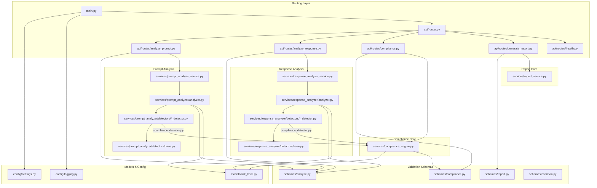
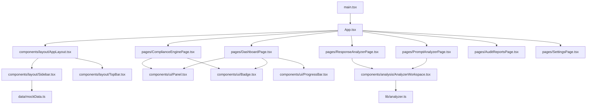

# Project Dependency & Concurrent Development Report

This report maps the module dependencies of the AI Governance & Compliance Copilot application and identifies independent development pathways to avoid merge conflicts.

---

## 1. Backend Dependency Graph

The following Mermaid diagram displays the import tree and dependency flows of the FastAPI backend application:



---

## 2. Frontend Dependency Graph

The React frontend components are modular and decoupled:



---

## 3. Parallel Development Pathways (Merge-Conflict Free)

To allow a multi-member team to deliver features rapidly without stepping on each other's code, we can structure development into **four independent pathways**:

### Pathway A: Individual Detectors (Plugin Strategy)
- **Work Area**: `backend/app/services/prompt_analyzer/detectors/` and `backend/app/services/response_analyzer/detectors/`
- **Why it is conflict-free**: Each detector is a separate file (e.g. `pii_detector.py`, `bias_detector.py`). A developer can add a new detector class or modify existing rules inside these files without affecting any others.
- **Architectural Recommendation**: Instead of importing and appending detectors manually in `analyzer.py`, implement dynamic package loading:
  ```python
  # Dynamic loading snippet for analyzer.py
  import pkgutil
  import importlib
  # Walk and load all sub-modules dynamically to prevent editing the analyzer.py registry
  ```

### Pathway B: Audit Report Compilation Engine
- **Work Area**: `backend/app/services/report_service.py` and `backend/app/schemas/report.py`
- **Why it is conflict-free**: This service compiles analytical outputs into formatted files (e.g., PDF generation using ReportLab, or CSV exports). It consumes schemas but operates entirely downstream from the real-time request analyzers.

### Pathway C: Database & Persistence Layer
- **Work Area**: Creating a new database module (e.g. `backend/app/db/` containing models, session managers, and Alembic migrations)
- **Why it is conflict-free**: Developing the database schema and queries is pure creation. The existing analyzers are stateless, meaning a developer can write repository classes to persist logs in the background without modifying the active code.

### Pathway D: Frontend UI Page Views
- **Work Area**: `frontend/src/pages/`
- **Why it is conflict-free**: The pages are standalone React components. Once the routing shell in `App.tsx` and `Sidebar.tsx` defines the URLs, developers can build the settings UI, dashboards, and reporting viewports in parallel.
